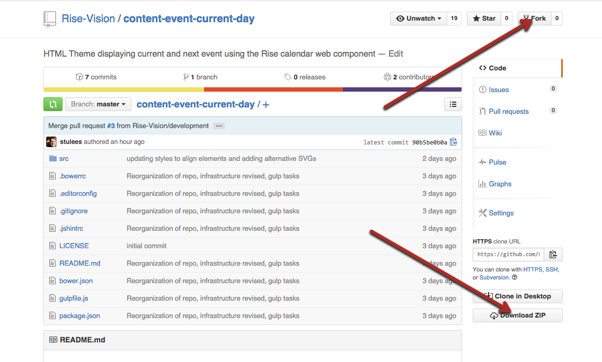
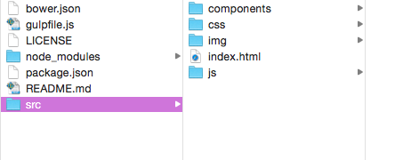
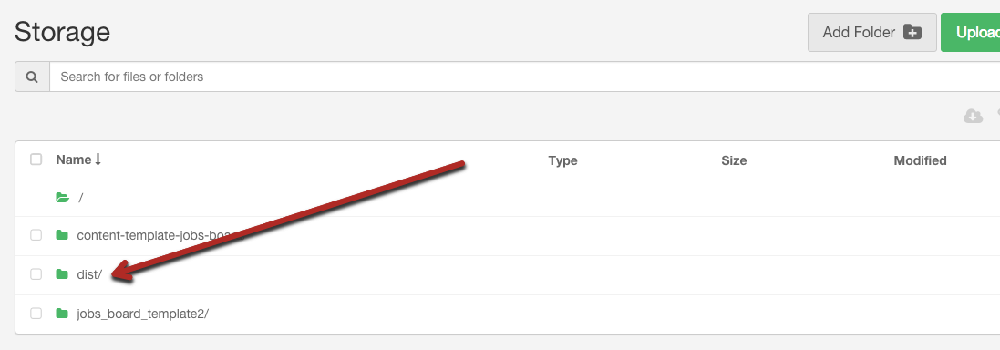
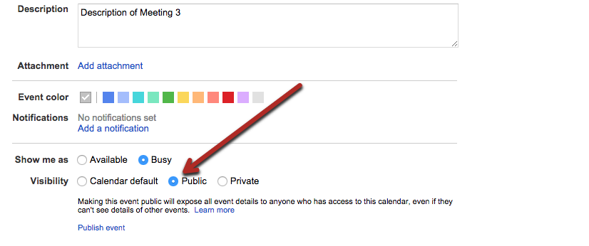
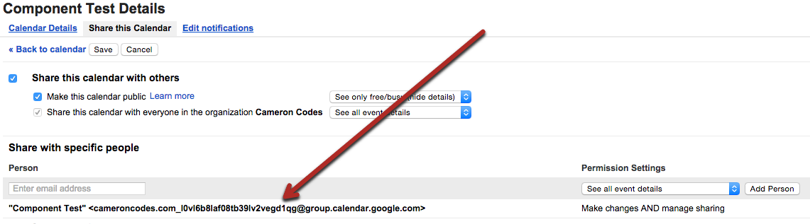

## Introduction

This HTML theme was created to display the current and next event for a single day using data from a google calendar using the `rise-google-calendar` component. Full documentation for the component can be found [here.](http://rise-vision.github.io/rise-google-calendar/components/rise-google-calendar/) 


## Steps to run the Current Event theme

1. Fork or download the entire content-event-current-day repository. You will also need to run `npm install` and `bower install` to install the dependencies required for the the theme. Bower is a package manager for Javascript libraries and frameworks. All third-party Javascript dependencies are listed in the bower.json file. To install Bower, run the following command in Terminal: `npm install -g bower`. Should you encounter any errors, try running the following command instead: `sudo npm install -g bower`.


2. Inside the content-event-current-day folder you will find the src folder. You can modify the files inside the src folder to fit your needs (see below on how to modify specific elements).  


3. Once any necessary modification have been made, a distribution folder containing all necessary files can be created using the following command while in the root diretory: `gulp build`. You can then host the newly created “dist” folder in rise vision storage or your web hosting service.  


4. Copy the link to the index.html file where you have it hosted and insert the url into a schedule. (you can also add this link to the url gadget within a presentation)  


##Directions to Modify the Event Theme:##

####Changing the Background Image

The background image for the theme can be changed by locating the following code within the style.css file within the css folder and modifying the path of the url to the image of your choice:

```
.wrapper:after {
  ...
  background-image: url("../img/city.jpeg");
  ...
```


####Changing the Icon Images

The images used for the icons in the theme are SVGs so that they will scale to fit different resolutions. To change the icons, open index.html, and locate the code for the specific icon within the section that you want to modify. For example, the code for the large calendar icon is found here:

```  
 
```

You can then change the src attribute to the path of the icon of your choice.


####Changing The Text Content
The text content is displayed through the use of the `rise-google-calendar` web component.
In order for the component to access the data you need to create a public google calendar and ensure that all events you create are also public. The settings menu for the calendar is located in the top right corner of the calendar page. The button to make the event public is found here:


The next step is to locate the following code in the index.html file:

```
  <rise-google-calendar
    calendar-id="cameroncodes.com_l0vl6b8laf08tb39lv2vegd1qg@group.calendar.google.com"
    refresh="5">
  </rise-google-calendar>

```

The `calendar-id` attribute should be set to the id for your own public calendar. This id can be found by selecting calendar settings, clicking on the calendars link in the top line, and then clicking on the 'Edit settings' or 'Shared: Edit settings' link corresponding to the calendar you wish to collect the data from. The ID for the calendar can then be copied from here:

You can then edit the text within the cells of the spreadsheet and the changes will appear in the display.


## Built With
actual tools used
- HTML
- CSS
- Rise-Google-Calendar Web Component
- Javascript
- JQuery


The Event - Current Day theme works in conjunction with [Rise Vision](http://www.risevision.com), the [digital signage management application](http://rva.risevision.com/) that runs on [Google Cloud](https://cloud.google.com).

At this time Chrome is the only browser that this project and Rise Vision supports.

## Submitting Issues
If you encounter problems or find defects we really want to hear about them. If you could take the time to add them as issues to this Repository it would be most appreciated. Please identify the specific template that has the issue and follow the following format where applicable:

**Reproduction Steps**

1. did this
2. then that
3. followed by this (screenshots / video captures always help)

**Expected Results**

What you expected to happen.

**Actual Results**

What actually happened. (screenshots / video captures always help)

## Contributing
All contributions are greatly appreciated and welcome! If you would first like to sound out your contribution ideas please post your thoughts to our [community](http://community.risevision.com), otherwise submit a pull request and we will do our best to incorporate it.

### Suggested Contributions
- Alternative displays of information
- Alternative ways to style text
- i18n Language Support

## Resources
If you have any questions or problems please don't hesitate to join our lively and responsive community at http://community.risevision.com.

If you are looking for user documentation on Rise Vision please see http://www.risevision.com/help/users/

If you would like more information on developing applications for Rise Vision please visit http://www.risevision.com/help/developers/.

 If you have any questions or problems please don't hesitate to join our lively and responsive community at http://community.risevision.com.
 
**Additional Content Templates can be found here: https://github.com/Rise-Vision/content-templates**

**Facilitator**

[Peter Sandford](https://github.com/pcsandford "Peter Sandford")

